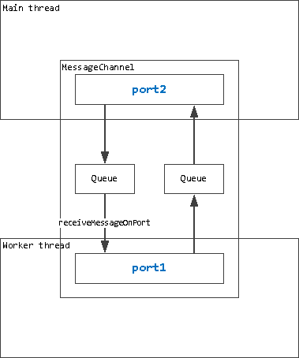

<details> <summary> Содержание </summary>

- [Worker threads](#worker-threads-рабочие-потоки)
  - [Введение](#введение)
  - [worker.getEnvironmentData(key)](#workergetenvironmentdatakey)
  - [worker.isMainThread](#workerismainthread)
  - [worker.markAsUntransferable(object)](#workermarkasuntransferableobject)
  - [worker.moveMessagePortToContext(port, contextifiedSandbox)](#workermovemessageporttocontextport-contextifiedsandbox)
  - [worker.parentPort](#workerparentport)
  - [worker.receiveMessageOnPort(port)](#workerreceivemessageonportport)
  - [worker.resourceLimits](#workerresourcelimits)
  - [worker.SHARE_ENV](#workershare_env)
  - [worker.setEnvironmentData(key[, value])](#workersetenvironmentdatakey-value)
  - [worker.threadId](#workerthreadid)
  - [worker.workerData](#workerworkerdata)
  - [Class: BroadcastChannel extends EventTarget](#class-broadcastchannel-extends-eventtarget)
    - [new BroadcastChannel(name)](#new-broadcastchannelname)
    - [broadcastChannel.close()](#broadcastchannelclose)
    - [broadcastChannel.onmessage](#broadcastchannelonmessage)
    - [broadcastChannel.onmessageerror](#broadcastchannelonmessageerror)
    - [broadcastChannel.postMessage(message)](#broadcastchannelpostmessagemessage)
    - [broadcastChannel.ref()](#broadcastchannelref)
    - [broadcastChannel.unref()](#broadcastchannelunref)
  - [Class: MessageChannel](#class-messagechannel)
  - [Class: MessagePort](#class-messageport)
    - [Event: 'close'](#event-close)
    - [Event: 'message'](#event-message)
    - [Event: 'messageerror'](#event-messageerror)
    - [port.close()](#portclose)
    - [port.postMessage(value[, transferList])](#portpostmessagevalue-transferlist)
      - [Рекоммендации при передаче "TypedArrays" и "Buffers"](#рекоммендации-при-передаче-typedarrays-и-buffers)
    - [port.ref()](#portref)
    - [port.start()](#portstart)
    - [port.unref()](#portunref)
  - [Class: Worker](#class-worker)
    - [new Worker(filename[, options])](#new-workerfilename-options)
    - [Event: 'error'](#event-error)
    - [Event: 'exit'](#event-exit)
    - [Event: 'message'](#event-message-1)
    - [Event: 'messageerror'](#event-messageerror-1)
    - [Event: 'online'](#event-online)
    - [worker.getHeapSnapshot()](#workergetheapsnapshot)
    - [worker.performance](#workerperformance)
      - performance.eventLoopUtilization([utilization1[, utilization2]])
    - [worker.postMessage(value[, transferList])](#workerpostmessagevalue-transferlist)
    - [worker.ref()](#workerref)
    - [worker.resourceLimits](#workerresourcelimits-1)
    - [worker.stderr](#workerstderr)
    - [worker.stdin](#workerstdin)
    - [worker.stdout](#workerstdout)
    - [worker.terminate()](#workerterminate)
    - [worker.threadId](#workerthreadid-1)
    - [worker.unref()](#workerref)
  - [Примечания](#примечания)
    - [Синхронная блокировка stdio](#синхронная-блокировка-stdio)
    - [Запуск рабочих потоков из скриптов предварительной загрузки](#запуск-рабочих-потоков-из-скриптов-предварительной-загрузки)

</details>

---

# Worker threads (Рабочие потоки)

## Введение

**Исходный код:** [lib/worker_threads.js](https://github.com/nodejs/node/blob/v14.21.1/lib/worker_threads.js)

Модуль `worker_threads` позволяет использовать потоки, параллельно выполняющие JavaScript. Чтобы получить к нему доступ пропишите:

```
const worker = require('worker_threads');
```

Рабочие потоки (**_worker threads_** / **_workers_**) полезны для выполнения операций JavaScript, требующих больших затрат процессора. Они не очень помогают при выполнении интенсивных операций ввода-вывода. Встроенные в Node.js асинхронные операции ввода-вывода более эффективны, чем Workers.

В отличие от `child_process` или `cluster`, `worker_threads` могут совместно использовать память. Они делают это путем передачи экземпляров `ArrayBuffer` или совместного использования экземпляров `SharedArrayBuffer`.

```
const {
  Worker, isMainThread, parentPort, workerData
} = require('worker_threads');

if (isMainThread) {
  module.exports = function parseJSAsync(script) {
    return new Promise((resolve, reject) => {
      const worker = new Worker(__filename, {
        workerData: script
      });
      worker.on('message', resolve);
      worker.on('error', reject);
      worker.on('exit', (code) => {
        if (code !== 0)
          reject(new Error(`Worker stopped with exit code ${code}`));
      });
    });
  };
} else {
  const { parse } = require('some-js-parsing-library');
  const script = workerData;
  parentPort.postMessage(parse(script));
}
```

В приведенном выше примере каждый вызова `parse()` порождает рабоий поток (worker / worker thread). В реальной практике для таких задач следует использовать пул (pool) рабочих потоков (workers / worker threads). В противном случае накладные расходы на создание рабочих потоков, скорее всего, превысят их пользу.

При реализации пула рабочих потоков используйте [`AsyncResource`](https://nodejs.org/dist/latest-v19.x/docs/api/async_hooks.html#class-asyncresource) API, предоставляющий инструменты диагностики (например, для предоставления асинхронных трассировок стека) для отслеживания взаимосвязи между задачами (tasks ) и их результатами. Пример реализации см. в разделе ["Использование AsyncResource для пула рабочих потоков"](https://nodejs.org/dist/latest-v19.x/docs/api/async_context.html#using-asyncresource-for-a-worker-thread-pool) в документации `async_hooks`.

По умолчанию, рабочие потоки наследуют параметры, не относящиеся к конкретному процессу. Обратитесь к [параметрам конструктора Worker (new Worker)](#new-workerfilename-options), чтобы узнать, как настроить параметры рабочего потока, в частности параметры argv и execArgv.

## worker.getEnvironmentData(key)

<details> <summary> История версий</summary>

| **Версия**         | **Изменения**                |
| ------------------ | ---------------------------- |
| v17.5.0, v16.15.0  | Больше не экспериментальный. |
| v15.12.0, v14.18.0 | Введён в Node.js             |

</details>

- **`key`** [\<any>](https://developer.mozilla.org/ru/docs/Web/JavaScript/Data_structures#%D1%82%D0%B8%D0%BF%D1%8B_%D0%B4%D0%B0%D0%BD%D0%BD%D1%8B%D1%85) Любое произвольное, клонируемое значение JavaScript, которое может быть использовано в качестве ключа [\<Map>](https://developer.mozilla.org/en-US/docs/Web/JavaScript/Reference/Global_Objects/Map).
- Returns: [\<any>](https://developer.mozilla.org/ru/docs/Web/JavaScript/Data_structures#%D1%82%D0%B8%D0%BF%D1%8B_%D0%B4%D0%B0%D0%BD%D0%BD%D1%8B%D1%85)

Внутри рабочего потока `worker.getEnvironmentData()` возвращает клон данных, переданных в `worker.setEnvironmentData()` порождающего потока. Каждый `new Worker` получает свою собственную копию данных об окружении автоматически.

```
const { Worker, isMainThread, setEnvironmentData, getEnvironmentData } = require('node:worker_threads')

if (isMainThread) {
  // Передаём key='anyKey' и value='anyValue' в текущий поток
  // во всее новые экземпляры класса Worker
  setEnvironmentData('anyKey', 'anyValue')

  // Повторно запускаем текущий файл в новом потоке worker
  const worker = new Worker(__filename)
} else {
  // Получаем данные из потока worker
  console.log(getEnvironmentData('anyKey')) // Выведет 'anyValue!'
}
```

## worker.isMainThread

**Добавлен в версии:** v10.5.0

- [\<boolean>](https://developer.mozilla.org/ru/docs/Web/JavaScript/Data_structures#%D0%B1%D1%83%D0%BB%D0%B5%D0%B2%D1%8B%D0%B9_%D1%82%D0%B8%D0%BF_%D0%B4%D0%B0%D0%BD%D0%BD%D1%8B%D1%85)

Возвращает `true`, если этот код не выполняется внутри потока [Worker](#class-worker).

```
const { Worker, isMainThread } = require('node:worker_threads')

if (isMainThread) {
  console.log(isMainThread) // true
  console.log('Вне рабочего потока (Worker)')

  // Это повторно загружает текущий файл внутри рабочего экземпляра.
  new Worker(__filename)
} else {
  console.log(isMainThread) // false
  console.log('Внутри рабочего потока (Worker)')
}
```

## worker.markAsUntransferable(object)

**Добавлен в версии:** v14.5.0, v12.19.0

Маркирует объект как не подлежащий передаче. Если объект встречается в списке передачи в вызове [port.postMessage()](#portpostmessagevalue-transferlist), он игнорируется.

В частности, это имеет смысл для объектов, которые можно клонировать, а не передавать, и которые используются другими объектами на передающей стороне. Например, таким образом Node.js помечает `ArrayBuffers`, которые он использует для своего [`Buffer` pool](https://nodejs.org/dist/latest-v19.x/docs/api/buffer.html#static-method-bufferallocunsafesize).

Эта операция не может быть отменена:

```
const { MessageChannel, markAsUntransferable } = require('node:worker_threads')

const pooledBuffer = new ArrayBuffer(8)
const typedArray1 = new Uint8Array(pooledBuffer)
const typedArray2 = new Float64Array(pooledBuffer)

// Пометили pooledBuffer как не не подлежащий переносу.
markAsUntransferable(pooledBuffer)

const { port1 } = new MessageChannel()
port1.postMessage(
  typedArray1, // пытаемся передать (transfer) typedArray1
  [typedArray1.buffer] // пытаемся передать pooledBuffer
)

// Выведем в консоль содержимое typedArray1 - он по-прежнему владеет
// своей памятью, т.к. он был клонирован, а не передан (transferred).
// Без `markAsUntransferable()` pooledBuffer и typedArray1 будут
// перенесены и в консоли выведет пустой Uint8Array.
console.log(typedArray1)
console.log(typedArray2) // typedArray2 также не затронут.
```

В браузерах нет эквивалента этому API.

## worker.moveMessagePortToContext(port, contextifiedSandbox)

**Добавлен в версии:** v14.5.0, v12.19.0

- **`port`** [\<MessagePort>](#class-messageport) Порт для передачи сообщений.

- **`contextifiedSandbox`** [\<Object>](https://developer.mozilla.org/ru/docs/Web/JavaScript/Reference/Global_Objects/Object) [Контекстифицированный](https://nodejs.org/dist/latest-v19.x/docs/api/vm.html#what-does-it-mean-to-contextify-an-object) объект, возвращаемый методом `vm.createContext()`.

- **Returns:** [\<MessagePort>](#class-messageport)

Переносит `MessagePort` в другой контекст [виртуальной машины](https://nodejs.org/dist/latest-v19.x/docs/api/vm.html). Исходный объект `порта` становится непригодным для использования, и его место занимает возвращенный экземпляр `MessagePort`.

Возвращенный `MessagePort` является объектом в целевом (target) контексте и наследуется от его глобального класса `Object`. Объекты, передаваемые прослушивателю [`port.onmessage()`](#portpostmessagevalue-transferlist), также создаются в целевом (target) контексте и наследуются от его глобального класса `Object`.

Однако созданный `MessagePort` больше не наследуется от [EventTarget](https://developer.mozilla.org/ru/docs/Web/API/EventTarget), и для получения событий с его помощью можно использовать только [`port.onmessage()`](#portpostmessagevalue-transferlist)

## worker.parentPort

**Добавлен в версии:** v10.5.0

- [\<null>](https://developer.mozilla.org/ru/docs/Web/JavaScript/Data_structures#null) | [\<MessagePort>](#class-messageport)

Если этот поток является экземпляром класса [Worker](#class-worker), то через экземпляр класса [`MessagePort`](#class-messageport) можно обеспечить связь с родительским потоком. Сообщения, отправленные с помощью `parentPort.postMessage()`, доступны в родительском потоке с помощью `worker.on('message')`, а сообщения, отправленные из родительского потока с помощью `worker.postMessage()`, доступны в этом потоке с помощью `parentPort.on('message')`.

```
const { Worker, isMainThread, parentPort } = require('node:worker_threads')

if (isMainThread) {
  // Повторно вызываеем файл, но уже внутри потока
  const worker = new Worker(__filename)

  // При получении message выведет его в консоль
  worker.once('message', (message) => {
    console.log(message) // Выведет Hello world!
  })

  // Отправляет сообщение 'Hello World!'
  worker.postMessage('Hello World!')
} else {
  // После получения message из родительского потока,
  // отправим message обратно в родительский поток.
  parentPort.once('message', (message) => {
    parentPort.postMessage(message)
  })
}
```

## worker.receiveMessageOnPort(port)

<details> <summary> История версий</summary>

| **Версия** | **Изменения**                                                    |
| ---------- | ---------------------------------------------------------------- |
| v15.12.0   | Аргумент порта теперь также может ссылаться на BroadcastChannel. |
| v12.3.0    | Добавлен в Node.js                                               |

</details>

- **`port`** [\<MessagePort>](#class-messageport) | [\<BroadcastChannel>](#class-broadcastchannel-extends-eventtarget)
- **Returns:** [\<Object>](https://developer.mozilla.org/ru/docs/Web/JavaScript/Reference/Global_Objects/Object) | [\<undefined>](https://developer.mozilla.org/ru/docs/Web/JavaScript/Data_structures#undefined)



Получение одного сообщения от данного `MessagePort`. Если сообщение отсутствует, возвращается undefined, в противном случае возвращается объект с единственным свойством message, которое содержит полезную нагрузку сообщения, соответствующую самому старому сообщению в очереди MessagePort.

```
const { MessageChannel, receiveMessageOnPort } = require('node:worker_threads')

// Создаём 2 порта, между которыми открывается канал
const { port1, port2 } = new MessageChannel()

// Отправляем message с port1 на port2
port1.postMessage({ hello: 'world' })

// Выведет { message: { hello: 'world' } }
console.log(receiveMessageOnPort(port2))

// Выведет undefined
console.log(receiveMessageOnPort(port2))
```

При использовании этой функции событие `'message'` не испускается и слушатель `onmessage` не вызывается.

## worker.resourceLimits

**Добавлен в версии:** v13.2.0, v12.16.0

- [\<Object>](https://developer.mozilla.org/ru/docs/Web/JavaScript/Reference/Global_Objects/Object)
  - **`maxYoungGenerationSizeMb`** [\<number>](https://developer.mozilla.org/ru/docs/Web/JavaScript/Data_structures#%D1%87%D0%B8%D1%81%D0%BB%D0%B0)
  - **`maxOldGenerationSizeMb`** [\<number>](https://developer.mozilla.org/ru/docs/Web/JavaScript/Data_structures#%D1%87%D0%B8%D1%81%D0%BB%D0%B0)
  - **`codeRangeSizeMb`** [\<number>](https://developer.mozilla.org/ru/docs/Web/JavaScript/Data_structures#%D1%87%D0%B8%D1%81%D0%BB%D0%B0)
  - **`stackSizeMb`** [\<number>](https://developer.mozilla.org/ru/docs/Web/JavaScript/Data_structures#%D1%87%D0%B8%D1%81%D0%BB%D0%B0)

Предоставляет набор ограничений ресурсов JS-движка внутри данного рабочего потока. Если конструктору [Worker](#class-worker) был передан параметр `resourceLimits`, этот параметр соответствует его значениям.

Если этот параметр используется в главном потоке, его значением будет пустой объект.

## worker.SHARE_ENV

**Добавлен в версии:** v11.14.0

- [\<symbol>](https://developer.mozilla.org/ru/docs/Web/JavaScript/Data_structures#%D1%82%D0%B8%D0%BF_%D0%B4%D0%B0%D0%BD%D0%BD%D1%8B%D1%85_%D1%81%D0%B8%D0%BC%D0%B2%D0%BE%D0%BB_symbol)

Специальное значение, которое может быть передано в качестве параметра `env` конструктора [Worker](#class-worker), чтобы указать, что текущий поток и рабочий поток должны иметь общий доступ на чтение и запись к одному и тому же набору переменных окружения.

```
const { Worker, SHARE_ENV } = require('node:worker_threads')

new Worker('process.env.SET_IN_WORKER = "foo"', { eval: true, env: SHARE_ENV }).on('exit', () => {
  console.log(process.env.SET_IN_WORKER) // Выведет 'foo'.
})
```

## worker.setEnvironmentData(key[, value])

<details><summary> История версий </summary>

| Версии             | Изменения               |
| ------------------ | ----------------------- |
| v17.5.0, v16.15.0  | No longer experimental. |
| v15.12.0, v14.18.0 | Добавлен в Node.js      |

</details>

- **`key`** [\<any>]() Любое произвольное, клонируемое значение JavaScript, которое может быть использовано в качестве ключа [\<Map>]().
- **`value`** [\<any>]() Любое произвольное, клонируемое значение JavaScript, которое будет клонировано и автоматически передано всем новым экземплярам класса `Worker`. Если значение передано как `undefined`, все ранее установленные значения для `key` будут удалены.

API `worker.setEnvironmentData()` устанавливает содержимое `worker.getEnvironmentData()` в текущем потоке и во всех новых экземплярах класса `Worker`, созданных из текущего контекста.

```
const { Worker, isMainThread, setEnvironmentData, getEnvironmentData } = require('node:worker_threads')

if (isMainThread) {
  // Передаём key='anyKey' и value='anyValue' в текущий поток
  // во всее новые экземпляры класса Worker
  setEnvironmentData('anyKey', 'anyValue')

  // Повторно запускаем текущий файл в новом потоке worker
  const worker = new Worker(__filename)
} else {
  // Получаем данные из потока worker
  console.log(getEnvironmentData('anyKey')) // Выведет 'anyValue!'
}
```

## worker.threadId

**Добавлен в версии:** v10.5.0

- [\<integer>](https://developer.mozilla.org/ru/docs/Web/JavaScript/Data_structures#%D1%87%D0%B8%D1%81%D0%BB%D0%B0)

Целочисленный идентификатор для текущего потока. Для соответствующего рабочего объекта (если таковой имеется) он доступен как [`worker.ThreadId`](#workerthreadid-1). Это значение уникально для каждого экземпляра класса [`Worker`](#class-worker) внутри одного процесса.

## worker.workerData

**Добавлен в версии:** v10.5.0

Произвольное JavaScript-значение, содержащее клон данных, переданных в конструктор класса `Worker` этого потока.

Данные клонируются как при использовании функции [`postMessage()`](#workerpostmessagevalue-transferlist), в соответствии с [алгоритмом структурированного клонирования HTML](https://developer.mozilla.org/ru/docs/Web/API/Web_Workers_API/Structured_clone_algorithm).

```
const { Worker, isMainThread, workerDat } = require('node:worker_threads')

if (isMainThread) {
  // Повторно запускаем файл в новом потоке worker
  // и как параметр, передаем в него workerData
  const worker = new Worker(__filename, { workerData: 'anyData' })
} else {
  // Получаем workerData
  console.log(workerData) // Выведет 'anyData'.
}

```

## Class: BroadcastChannel extends EventTarget

<details> <summary>История версий</summary>

| Версия  | Изменения                    |
| ------- | ---------------------------- |
| v18.0.0 | Больше не экспериментальный. |
| v15.4.0 | Добавлен в Node.js           |

</details>

Экземпляры класса `BroadcastChannel` позволяют устанавливать асинхронную связь "один ко многим" со всеми другими экземплярами класса `BroadcastChannel`, привязанными к тому же имени канала.

> **Примечание переводчика:**  
> Параметр `name` даёт имя экземпляру класса `BroadcastChannel`, для того чтобы другие экземпляры `BroadcastChannel`
> могли подключиться к нашему каналу, идентифицировав его по имени.

```
'use strict';

const { isMainThread, BroadcastChannel, Worker } = require('node:worker_threads')

// Создаем новый канал
const bc = new BroadcastChannel('Hello')

if (isMainThread) {
  let c = 0
  bc.onmessage = (event) => {
    console.log(event.data) // выведет 'Сообщение для каждого Worker'
    // закрываем канал когда сообщение будет получено 10 раз
    if (++c === 10) bc.close()
  }
  // создаём 10 рабочих потоков, и в каждом запускаем этот файл
  for (let n = 0; n < 10; n++) new Worker(__filename)
} else {
  //  BroadcastChannel отправляет сообщение, коорое
  // получат все экземпляры Worker
  bc.postMessage('Сообщение для каждого Worker')
  bc.close
}
```

### new BroadcastChannel(name)

**Добавлен в версии:** v15.4.0

- **`name`** [\<any>](https://developer.mozilla.org/ru/docs/Web/JavaScript/Data_structures#%D1%82%D0%B8%D0%BF%D1%8B_%D0%B4%D0%B0%D0%BD%D0%BD%D1%8B%D1%85) Имя (наименование) канала, к которому нужно подключиться. Разрешено любое JavaScript-значение, которое может быть преобразовано в строку с помощью `${name}`.

```
const { BroadcastChannel } = require('node:worker_threads')

const bc1 = new BroadcastChannel('test-channel')
const bc2 = new BroadcastChannel('test-channel')
const bc3 = new BroadcastChannel('another channel')

bc1.onmessage = (event) => {
  console.log(event.target)
  console.log(event.data)
}

bc2.onmessage = (event) => {
  console.log(event.target)
  console.log(event.data)
}

bc3.onmessage = (event) => {
  console.log(event.target)
  console.log(event.data)
}

bc1.postMessage('Сообщение от bc1 для "test-channel"')
bc2.postMessage('Сообщение от bc2 для "test-channel"')
bc3.postMessage('Сообщение от bc3 для "another-channel"')

// В консоли выведет:
//
// BroadcastChannel { name: 'test-channel', active: true }
// Сообщение от bc1 для "test-channel"
//
// BroadcastChannel { name: 'test-channel', active: true }
// Сообщение от bc2 для "test-channel"
```

### broadcastChannel.close()

**Добавлен в версии:** 15.4.0

Завершает `BroadcastChannel` соединение.

### broadcastChannel.onmessage

**Добавлен в версии:** 15.4.0

- Type: [\<Function>](https://developer.mozilla.org/ru/docs/Web/JavaScript/Reference/Global_Objects/Function) Вызывается с одним аргументом `MessageEvent` при получении сообщения.

```
const { BroadcastChannel } = require('node:worker_threads')

const bc = new BroadcastChannel('test-channel')

bc.onmessage = (event) => {
  console.log(event.target)
  console.log(event.data)
}
```

### broadcastChannel.onmessageerror

**Добавлен в версии:** 15.4.0

- Type: [\<Function>](https://developer.mozilla.org/ru/docs/Web/JavaScript/Reference/Global_Objects/Function) Событие вызывается когда получено сообщение, которое не может быть десериализовано., т.е. при поступлении некорректного сообщения.

### broadcastChannel.postMessage(message)

**Добавлен в версии:** 15.4.0

- **`message `** [\<any>](https://developer.mozilla.org/ru/docs/Web/JavaScript/Data_structures#%D1%82%D0%B8%D0%BF%D1%8B_%D0%B4%D0%B0%D0%BD%D0%BD%D1%8B%D1%85) Любое клонируемое JavaScript-значение.

### broadcastChannel.ref()

**Добавлен в версии:** 15.4.0

Противоположность `unref()`. Если ранее `BroadcastChannel` был `unref()`, то вызов `ref()` запретит программе завершить работу, если это единственный оставшийся активный обработчик (поведение по умолчанию). Если же порт уже имеет значение `ref()`, то повторный вызов `ref()` не будет имеет никакого эффекта.

### broadcastChannel.unref()

**Добавлен в версии:** 15.4.0

Вызов `unref()` на `BroadcastChannel` позволяет потоку завершить работу, даже если это единственный активный обработчик в системе событий. Если канал `BroadcastChannel` уже был `unref()`, повторный вызов `unref()` не будет иметь никакого эффекта.

# Осталось

## Class: MessageChannel

**Добавлен в версии:**

## Class: MessagePort

**Добавлен в версии:**

### Event: 'close'

**Добавлен в версии:**

### Event: 'message'

**Добавлен в версии:**

### Event: 'messageerror'

**Добавлен в версии:**

### port.close()

**Добавлен в версии:**

### port.postMessage(value[, transferList])

**Добавлен в версии:**

#### Рекоммендации при передаче TypedArrays и Buffers

**Добавлен в версии:**

### port.ref()

**Добавлен в версии:**

### port.start()

**Добавлен в версии:**

### port.unref()

**Добавлен в версии:**

## Class: Worker

**Добавлен в версии:**

### new Worker(filename[, options])

**Добавлен в версии:**

### Event: 'error'

**Добавлен в версии:**

### Event: 'exit'

**Добавлен в версии:**

### Event: 'message'

**Добавлен в версии:**

### Event: 'messageerror'

**Добавлен в версии:**

### Event: 'online'

**Добавлен в версии:**

### worker.getHeapSnapshot()

**Добавлен в версии:**

### worker.performance

**Добавлен в версии:**

#### performance.eventLoopUtilization([utilization1[, utilization2]])

**Добавлен в версии:**

### worker.postMessage(value[, transferList])

**Добавлен в версии:**

### worker.ref()

**Добавлен в версии:**

### worker.resourceLimits

**Добавлен в версии:**

### worker.stderr

**Добавлен в версии:**

### worker.stdin

**Добавлен в версии:**

### worker.stdout

**Добавлен в версии:**

### worker.terminate()

**Добавлен в версии:**

### worker.threadId

**Добавлен в версии:**

### worker.unref()

**Добавлен в версии:**

## Примечания

**Добавлен в версии:**

### Синхронная блокировка stdio

**Добавлен в версии:**

### Запуск рабочих потоков из скриптов предварительной загрузки

**Добавлен в версии:**
