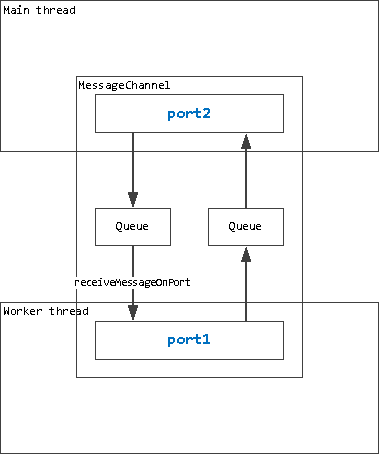

<details> <summary> Содержание </summary>

- [Worker threads](#worker-threads-рабочие-потоки)
  - [Введение](#введение)
  - [worker.getEnvironmentData(key)](#workergetenvironmentdatakey)
  - [worker.isMainThread](#workerismainthread)
  - [worker.markAsUntransferable(object)](#workermarkasuntransferableobject)
  - [worker.moveMessagePortToContext(port, contextifiedSandbox)](#workermovemessageporttocontextport-contextifiedsandbox)
  - [worker.parentPort](#workerparentport)
  - [worker.receiveMessageOnPort(port)](#workerreceivemessageonportport)
  - [worker.resourceLimits](#workerresourcelimits)
  - [worker.SHARE_ENV](#workershare_env)
  - [worker.setEnvironmentData(key[, value])](#workersetenvironmentdatakey-value)
  - [worker.threadId](#workerthreadid)
  - [worker.workerData](#workerworkerdata)
  - [Class: BroadcastChannel extends EventTarget](#class-broadcastchannel-extends-eventtarget)
    - [new BroadcastChannel(name)](#new-broadcastchannelname)
    - [broadcastChannel.close()](#broadcastchannelclose)
    - [broadcastChannel.onmessage](#broadcastchannelonmessage)
    - [broadcastChannel.onmessageerror](#broadcastchannelonmessageerror)
    - [broadcastChannel.postMessage(message)](#broadcastchannelpostmessagemessage)
    - [broadcastChannel.ref()](#broadcastchannelref)
    - [broadcastChannel.unref()](#broadcastchannelunref)
  - [Class: MessageChannel](#class-messagechannel)
  - [Class: MessagePort](#class-messageport)
    - [Event: 'close'](#event-close)
    - [Event: 'message'](#event-message)
    - [Event: 'messageerror'](#event-messageerror)
    - [port.close()](#portclose)
    - [port.postMessage(value[, transferList])](#portpostmessagevalue-transferlist)
      - [Рекоммендации при передаче "TypedArrays" и "Buffers"](#рекоммендации-при-передаче-typedarrays-и-buffers)
      - [Рекоммендации при клонировании объектов с помощью прототипов, классов и методов доступа](#рекоммендации-при-клонировании-объектов-с-помощью-прототипов-классов-и-методов-доступа)
    - [port.hasRef()](#porthasref)
    - [port.ref()](#portref)
    - [port.start()](#portstart)
    - [port.unref()](#portunref)
  - [Class: Worker](#class-worker)
    - [new Worker(filename[, options])](#new-workerfilename-options)
    - [Event: 'error'](#event-error)
    - [Event: 'exit'](#event-exit)
    - [Event: 'message'](#event-message-1)
    - [Event: 'messageerror'](#event-messageerror-1)
    - [Event: 'online'](#event-online)
    - [worker.getHeapSnapshot()](#workergetheapsnapshot)
    - [worker.performance](#workerperformance)
      - [performance.eventLoopUtilization(utilization1, utilization2)](#performanceeventlooputilizationutilization1-utilization2)
    - [worker.postMessage(value[, transferList])](#workerpostmessagevalue-transferlist)
    - [worker.ref()](#workerref)
    - [worker.resourceLimits](#workerresourcelimits-1)
    - [worker.stderr](#workerstderr)
    - [worker.stdin](#workerstdin)
    - [worker.stdout](#workerstdout)
    - [worker.terminate()](#workerterminate)
    - [worker.threadId](#workerthreadid-1)
    - [worker.unref()](#workerref)
  - [Примечания](#примечания)
    - [Синхронная блокировка stdio](#синхронная-блокировка-stdio)
    - [Запуск рабочих потоков из скриптов предварительной загрузки](#запуск-рабочих-потоков-из-скриптов-предварительной-загрузки)

</details>

---

# **Worker threads (Рабочие потоки)**

## **Введение**

**Исходный код:** [lib/worker_threads.js](https://github.com/nodejs/node/blob/v14.21.1/lib/worker_threads.js)

Модуль `worker_threads` позволяет использовать потоки, для параллельного выполнения JavaScript-кода. Для подключения модуля пропишите:

```javascript
const worker = require('worker_threads')
```

Рабочие потоки (**_worker threads_** / **_workers_**) полезны для выполнения JavaScript-операций, требующих больших затрат ресурсов процессора. Рабочие потоки слабо помогают при выполнении интенсивных операций ввода-вывода (I/O). Встроенные в Node.js асинхронные операции ввода-вывода более эффективны, чем рабочие потоки.

В отличие от `child_process` или `cluster`, `worker_threads` могут **совместно** использовать память. Они делают это путем передачи экземпляров `ArrayBuffer` или совместного использования экземпляров `SharedArrayBuffer`.

```javascript
const { Worker, isMainThread, parentPort, workerData } = require('worker_threads')

if (isMainThread) {
  module.exports = function parseJSAsync(script) {
    return new Promise((resolve, reject) => {
      const worker = new Worker(__filename, {
        workerData: script,
      })
      worker.on('message', resolve)
      worker.on('error', reject)
      worker.on('exit', (code) => {
        if (code !== 0) reject(new Error(`Worker остановлен с кодом выхода ${code}`))
      })
    })
  }
} else {
  const { parse } = require('some-js-parsing-library')
  const script = workerData
  parentPort.postMessage(parse(script))
}
```

В приведенном выше примере каждый вызов `parse()` будет порождать новый рабоий поток. В реальной практике для таких задач следует использовать пул рабочих потоков (Workers pool). Иначе "накладные расходы" на создание рабочих потоков, скорее всего, превысят их пользу.

При реализации пула рабочих потоков используйте [`AsyncResource `](https://nodejs.org/dist/latest-v19.x/docs/api/async_hooks.html#class-asyncresource) API, предоставляющий инструменты диагностики (например, для предоставления асинхронных трассировок стека) для отслеживания взаимосвязи между задачами (tasks ) и их результатами. Пример реализации см. в разделе ["Использование AsyncResource для пула рабочих потоков"](https://nodejs.org/dist/latest-v19.x/docs/api/async_context.html#using-asyncresource-for-a-worker-thread-pool) в документации `async_hooks`.

По умолчанию, рабочие потоки наследуют параметры, не относящиеся к конкретному процессу. Обратитесь к [параметрам конструктора Worker (new Worker)](#new-workerfilename-options), чтобы узнать, как настроить параметры рабочего потока, в частности параметры argv и execArgv.

## **worker.getEnvironmentData(key)**

<details> <summary> История версий</summary>

| **Версия**         | **Изменения**                |
| ------------------ | ---------------------------- |
| v17.5.0, v16.15.0  | Больше не экспериментальный. |
| v15.12.0, v14.18.0 | Введён в Node.js             |

</details>

- **`key`** [\<any>](https://developer.mozilla.org/ru/docs/Web/JavaScript/Data_structures#%D1%82%D0%B8%D0%BF%D1%8B_%D0%B4%D0%B0%D0%BD%D0%BD%D1%8B%D1%85) Любое произвольное, клонируемое значение JavaScript, которое может быть использовано в качестве ключа [\<Map>](https://developer.mozilla.org/en-US/docs/Web/JavaScript/Reference/Global_Objects/Map).
- Returns: [\<any>](https://developer.mozilla.org/ru/docs/Web/JavaScript/Data_structures#%D1%82%D0%B8%D0%BF%D1%8B_%D0%B4%D0%B0%D0%BD%D0%BD%D1%8B%D1%85)

> **Рекоммендация переводчика:**  
> `worker.getEnvironmentData()` работает в связке с `worker.setEnvironmentData()`. Логически правильым будет сначала изучить [`worker.setEnvironmentData()`](#workersetenvironmentdatakey-value), и только потом `worker.setEnvironmentData()`.

Внутри рабочего потока `worker.getEnvironmentData()` возвращает клон данных, переданных в пораждающие потоки через `worker.setEnvironmentData()`. Каждый новый экземпляр класса `Worker` автоматически получает свою собственную копию данных об окружении.

```javascript
const { Worker, isMainThread, setEnvironmentData, getEnvironmentData } = require('node:worker_threads')

if (isMainThread) {
  // Передаём key='anyKey' и value='anyValue' в текущий поток
  // во всее новые экземпляры класса Worker
  setEnvironmentData('anyKey', 'anyValue')

  // Повторно запускаем текущий файл в новом потоке worker
  const worker = new Worker(__filename)
} else {
  // Получаем данные из потока worker
  console.log(getEnvironmentData('anyKey')) // Выведет 'anyValue!'
}
```

## **worker.isMainThread**

**Добавлен в версии:** v10.5.0

- [\<boolean>](https://developer.mozilla.org/ru/docs/Web/JavaScript/Data_structures#%D0%B1%D1%83%D0%BB%D0%B5%D0%B2%D1%8B%D0%B9_%D1%82%D0%B8%D0%BF_%D0%B4%D0%B0%D0%BD%D0%BD%D1%8B%D1%85)

Возвращает `true`, если этот код **_не выполняется_** внутри рабочего потока [Worker](#class-worker).

```javascript
const { Worker, isMainThread } = require('node:worker_threads')

if (isMainThread) {
  console.log(isMainThread) // true
  console.log('Вне рабочего потока (Worker)')

  // Это повторно загружает текущий файл внутри рабочего экземпляра.
  new Worker(__filename)
} else {
  console.log(isMainThread) // false
  console.log('Внутри рабочего потока (Worker)')
}
```

## **worker.markAsUntransferable(object)**

**Добавлен в версии:** v14.5.0, v12.19.0

При вызове [`port.postMessage(value, transferList)`](#portpostmessagevalue-transferlist), в зависимости от вида объекта, объект могут либо передаваться (transfer) в рабочий поток, либо клонироваться (clone) в него. При этом, когда объект передаётся (transfered) в рабочий поток, этот объект может стать недоступным для использования в первоначальном потоке. Это зависит от типа объекта.

`worker.markAsUntransferable(object)` маркирует объект как **_не подлежащий передаче_**. Если промаркированный объект встречается в списке передачи (transfer list), который передаётся в качестве аргумента при вызове [`port.postMessage(value, transferList)`](#portpostmessagevalue-transferlist), то этот маркированный объект игнорируется (не передаётся).

В частности, это имеет смысл для объектов, которые можно клонировать, а не передавать, и которые используются другими объектами на передающей стороне. Например, таким образом Node.js помечает `ArrayBuffers`, которые он использует для своего [`Buffer` pool](https://nodejs.org/dist/latest-v19.x/docs/api/buffer.html#static-method-bufferallocunsafesize).

Эта операция не может быть отменена:

```javascript
const { MessageChannel, markAsUntransferable } = require('node:worker_threads')

const pooledBuffer = new ArrayBuffer(8)
const typedArray1 = new Uint8Array(pooledBuffer)
const typedArray2 = new Float64Array(pooledBuffer)

// Пометили pooledBuffer как не не подлежащий переносу.
markAsUntransferable(pooledBuffer)

const { port1 } = new MessageChannel()
port1.postMessage(
  typedArray1, // пытаемся передать (transfer) typedArray1
  [typedArray1.buffer] // пытаемся передать pooledBuffer
)

// Выведем в консоль содержимое typedArray1 - он по-прежнему владеет
// своей памятью, т.к. он был клонирован, а не передан (transferred).
// Без `markAsUntransferable()` pooledBuffer и typedArray1 будут
// перенесены и в консоли выведет пустой Uint8Array.
console.log(typedArray1)
console.log(typedArray2) // typedArray2 также не затронут.
```

В браузерах нет эквивалента этому API.

## **worker.moveMessagePortToContext(port, contextifiedSandbox)**

**Добавлен в версии:** v14.5.0, v12.19.0

- **`port`** [\<MessagePort>](#class-messageport) Порт для передачи сообщений.

- **`contextifiedSandbox`** [\<Object>](https://developer.mozilla.org/ru/docs/Web/JavaScript/Reference/Global_Objects/Object)
  [Контекстифицированный](https://nodejs.org/dist/latest-v19.x/docs/api/vm.html#what-does-it-mean-to-contextify-an-object) объект, возвращаемый методом `vm.createContext()`.
- Returns: [\<MessagePort>](#class-messageport)

Переносит `MessagePort` в другой контекст [виртуальной машины](https://nodejs.org/dist/latest-v19.x/docs/api/vm.html). Исходный объект `port` становится непригодным для использования, и его место занимает возвращенный экземпляр `MessagePort`.

Возвращённый `MessagePort` является объектом в целевом (target) контексте и наследуется от его глобального класса `Object`. Объекты, передаваемые слушивателю [`port.onmessage()`](#portpostmessagevalue-transferlist), также создаются в целевом (target) контексте и наследуются от его глобального класса `Object`.

Вместе с тем, созданный `MessagePort` больше не наследуется от [EventTarget](https://developer.mozilla.org/ru/docs/Web/API/EventTarget). Таким образом, для обработки события 'message' (получение сообщения) можно использовать только [`port.onmessage()`](#portpostmessagevalue-transferlist)

## **worker.parentPort**

**Добавлен в версии:** v10.5.0

- [\<null>](https://developer.mozilla.org/ru/docs/Web/JavaScript/Data_structures#null) | [\<MessagePort>](#class-messageport)

Если текущий поток является экземпляром класса [Worker](#class-worker), то через экземпляр класса [`MessagePort`](#class-messageport) можно обеспечить связь с родительским потоком. Сообщения, отправленные с помощью `parentPort.postMessage()`, доступны в родительском потоке с помощью `worker.on('message')`, а сообщения, отправленные из родительского потока с помощью `worker.postMessage()`, доступны в этом потоке с помощью `parentPort.on('message')`.

```javascript
const { Worker, isMainThread, parentPort } = require('node:worker_threads')

if (isMainThread) {
  // Повторно вызываеем файл, но уже внутри потока
  const worker = new Worker(__filename)

  // При получении message выведет его в консоль
  worker.once('message', (message) => {
    console.log(message) // Выведет Hello world!
  })

  // Отправляем сообщение 'Hello World!'
  worker.postMessage('Hello World!')
} else {
  // После получения message из родительского потока,
  // отправим этот же message обратно в родительский поток.
  parentPort.once('message', (message) => {
    parentPort.postMessage(message)
  })
}
```

## **worker.receiveMessageOnPort(port)**

<details> <summary> История версий</summary>

| **Версия** | **Изменения**                                                       |
| ---------- | ------------------------------------------------------------------- |
| v15.12.0   | Аргумент `port` теперь также может ссылаться на `BroadcastChannel`. |
| v12.3.0    | Добавлен в Node.js                                                  |

</details>

- **`port`** [\<MessagePort>](#class-messageport) | [\<BroadcastChannel>](#class-broadcastchannel-extends-eventtarget)
- Returns: [\<Object>](https://developer.mozilla.org/ru/docs/Web/JavaScript/Reference/Global_Objects/Object) | [\<undefined>](https://developer.mozilla.org/ru/docs/Web/JavaScript/Data_structures#undefined)



С помощью `worker.receiveMessageOnPort(port)` можно получить одно сообщение от экземпляра `MessagePort`. Если сообщение отсутствует, возвращается undefined, в противном случае возвращается объект `{ message: payload }` c единcтвенным свойством message, которое содержит полезную нагрузку (payload) сообщения, соответствующую самому старому сообщению в очереди `MessagePort`.

```javascript
const { MessageChannel, receiveMessageOnPort } = require('node:worker_threads')

// Создаём 2 порта, между которыми открывается канал
const { port1, port2 } = new MessageChannel()

// Отправляем message с port1 на port2
port1.postMessage({ hello: 'world' })

// Выведет { message: { hello: 'world' } }
console.log(receiveMessageOnPort(port2))

// Выведет undefined
console.log(receiveMessageOnPort(port2))
```

При использовании этой функции событие `'message'` не генерируется и слушатель `onmessage` не вызывается.

## **worker.resourceLimits**

**Добавлен в версии:** v13.2.0, v12.16.0

- [\<Object>](https://developer.mozilla.org/ru/docs/Web/JavaScript/Reference/Global_Objects/Object)
  - **`maxYoungGenerationSizeMb`** [\<number>](https://developer.mozilla.org/ru/docs/Web/JavaScript/Data_structures#%D1%87%D0%B8%D1%81%D0%BB%D0%B0)
  - **`maxOldGenerationSizeMb`** [\<number>](https://developer.mozilla.org/ru/docs/Web/JavaScript/Data_structures#%D1%87%D0%B8%D1%81%D0%BB%D0%B0)
  - **`codeRangeSizeMb`** [\<number>](https://developer.mozilla.org/ru/docs/Web/JavaScript/Data_structures#%D1%87%D0%B8%D1%81%D0%BB%D0%B0)
  - **`stackSizeMb`** [\<number>](https://developer.mozilla.org/ru/docs/Web/JavaScript/Data_structures#%D1%87%D0%B8%D1%81%D0%BB%D0%B0)

Предоставляет набор параметров для ограничения ресурсов JS-движка внутри данного рабочего потока. Если конструктору [`new Worker`](#class-worker) был передан параметр `resourceLimits`, то этот параметр будет соответствовать значениям созданного экземпляра класса `Worker`.

Если этот параметр используется в основном потоке, его значением будет пустой объект.

## **worker.SHARE_ENV**

**Добавлен в версии:** v11.14.0

- [\<symbol>](https://developer.mozilla.org/ru/docs/Web/JavaScript/Data_structures#%D1%82%D0%B8%D0%BF_%D0%B4%D0%B0%D0%BD%D0%BD%D1%8B%D1%85_%D1%81%D0%B8%D0%BC%D0%B2%D0%BE%D0%BB_symbol)

Специальное значение, которое может быть передано в качестве параметра `env` конструктора [`new Worker`](#class-worker), чтобы указать, что текущий поток и созданный рабочий поток должны иметь **_общий доступ_** на чтение и запись к одному и тому же набору переменных окружения.

```javascript
const { Worker, SHARE_ENV } = require('node:worker_threads')

new Worker('process.env.SET_IN_WORKER = "foo"', { eval: true, env: SHARE_ENV }).on('exit', () => {
  console.log(process.env.SET_IN_WORKER) // Выведет 'foo'.
})
```

## **worker.setEnvironmentData(key[, value])**

<details><summary> История версий </summary>

| Версия             | Изменения                   |
| ------------------ | --------------------------- |
| v17.5.0, v16.15.0  | Больше не эксперементальный |
| v15.12.0, v14.18.0 | Добавлен в Node.js          |

</details>

- **`key`** [\<any>]() Любое произвольное, клонируемое JavaScript-значение, которое может быть использовано в качестве ключа [\<Map>]().
- **`value`** [\<any>]() Любое произвольное, клонируемое JavaScript-значение, которое будет клонировано и автоматически передано всем новым экземплярам класса `Worker`. Если значение передано как `undefined`, все ранее установленные значения (`value`) для `key` будут удалены.

API `worker.setEnvironmentData()` устанавливает содержимое `worker.getEnvironmentData()` в текущем потоке и во всех новых экземплярах класса `Worker`, созданных из текущего контекста.

```javascript
const { Worker, isMainThread, setEnvironmentData, getEnvironmentData } = require('node:worker_threads')

if (isMainThread) {
  // Передаём key='anyKey' и value='anyValue' в текущий поток
  // во всее новые экземпляры класса Worker
  setEnvironmentData('anyKey', 'anyValue')

  // Повторно запускаем текущий файл в новом потоке worker
  const worker = new Worker(__filename)
} else {
  // Получаем данные из потока worker
  console.log(getEnvironmentData('anyKey')) // Выведет 'anyValue!'
}
```

## **worker.threadId**

**Добавлен в версии:** v10.5.0

- [\<integer>](https://developer.mozilla.org/ru/docs/Web/JavaScript/Data_structures#%D1%87%D0%B8%D1%81%D0%BB%D0%B0)

Целочисленный идентификатор для текущего потока. Для соответствующего рабочего объекта (если таковой имеется) он доступен как [`worker.ThreadId`](#workerthreadid-1). Это значение уникально для каждого экземпляра класса [`Worker`](#class-worker) внутри одного процесса.

## **worker.workerData**

**Добавлен в версии:** v10.5.0

Произвольное JavaScript-значение, содержащее клон данных, переданных в конструктор класса `Worker` этого потока.

Данные клонируются также, как и при использовании функции [`postMessage()`](#workerpostmessagevalue-transferlist), в соответствии с [алгоритмом структурированного клонирования HTML](https://developer.mozilla.org/ru/docs/Web/API/Web_Workers_API/Structured_clone_algorithm).

```javascript
const { Worker, isMainThread, workerDat } = require('node:worker_threads')

if (isMainThread) {
  // Повторно запускаем файл в новом потоке worker
  // и как параметр, передаем в него workerData
  const worker = new Worker(__filename, { workerData: 'anyData' })
} else {
  // Получаем workerData
  console.log(workerData) // Выведет 'anyData'.
}
```

## **Class: BroadcastChannel extends EventTarget**

<details> <summary>История версий</summary>

| Версия  | Изменения                    |
| ------- | ---------------------------- |
| v18.0.0 | Больше не экспериментальный. |
| v15.4.0 | Добавлен в Node.js           |

</details>

Экземпляры класса `BroadcastChannel` позволяют устанавливать асинхронную связь "один ко многим" со всеми другими экземплярами класса `BroadcastChannel` с тем же именем (`name`) канала.

> **Примечание переводчика:**  
> Параметр `name` задаёт имя экземпляру класса `BroadcastChannel`, для того чтобы другие экземпляры `BroadcastChannel`
> могли подключиться к нашему каналу, идентифицировав его по имени.

```javascript
'use strict'

const { isMainThread, BroadcastChannel, Worker } = require('node:worker_threads')

// Создаем новый канал
const bc = new BroadcastChannel('Hello')

if (isMainThread) {
  let c = 0
  bc.onmessage = (event) => {
    console.log(event.data) // выведет 'Сообщение для каждого Worker'
    // закрываем канал когда сообщение будет получено 10 раз
    if (++c === 10) bc.close()
  }
  // создаём 10 рабочих потоков, и в каждом запускаем этот файл
  for (let n = 0; n < 10; n++) new Worker(__filename)
} else {
  //  BroadcastChannel отправляет сообщение, коорое
  // получат все экземпляры Worker
  bc.postMessage('Сообщение для каждого Worker')
  bc.close
}
```

### **new BroadcastChannel(name)**

**Добавлен в версии:** v15.4.0

- **`name`** [\<any>](https://developer.mozilla.org/ru/docs/Web/JavaScript/Data_structures#%D1%82%D0%B8%D0%BF%D1%8B_%D0%B4%D0%B0%D0%BD%D0%BD%D1%8B%D1%85) Имя (наименование) канала, к которому нужно подключиться. Разрешено любое JavaScript-значение, которое может быть преобразовано в строку с помощью `${name}`.

```javascript
const { BroadcastChannel } = require('node:worker_threads')

const bc1 = new BroadcastChannel('test-channel')
const bc2 = new BroadcastChannel('test-channel')
const bc3 = new BroadcastChannel('another channel')

bc1.onmessage = (event) => {
  console.log(event.target)
  console.log(event.data)
}

bc2.onmessage = (event) => {
  console.log(event.target)
  console.log(event.data)
}

bc3.onmessage = (event) => {
  console.log(event.target)
  console.log(event.data)
}

bc1.postMessage('Сообщение от bc1 для "test-channel"')
bc2.postMessage('Сообщение от bc2 для "test-channel"')
bc3.postMessage('Сообщение от bc3 для "another-channel"')

// В консоли выведет:
//
// BroadcastChannel { name: 'test-channel', active: true }
// Сообщение от bc1 для "test-channel"
//
// BroadcastChannel { name: 'test-channel', active: true }
// Сообщение от bc2 для "test-channel"
```

### **broadcastChannel.close()**

**Добавлен в версии:** 15.4.0

Завершает `BroadcastChannel` соединение.

### **broadcastChannel.onmessage**

**Добавлен в версии:** 15.4.0

- Type: [\<Function>](https://developer.mozilla.org/ru/docs/Web/JavaScript/Reference/Global_Objects/Function) Вызывается с одним аргументом `MessageEvent` при получении сообщения.

```javascript
const { BroadcastChannel } = require('node:worker_threads')

const bc = new BroadcastChannel('test-channel')

bc.onmessage = (event) => {
  console.log(event.target)
  console.log(event.data)
}
```

### **broadcastChannel.onmessageerror**

**Добавлен в версии:** 15.4.0

- Type: [\<Function>](https://developer.mozilla.org/ru/docs/Web/JavaScript/Reference/Global_Objects/Function) Событие вызывается когда получено сообщение, которое не может быть десериализовано., т.е. при поступлении некорректного сообщения.

### **broadcastChannel.postMessage(message)**

**Добавлен в версии:** 15.4.0

- **`message `** [\<any>](https://developer.mozilla.org/ru/docs/Web/JavaScript/Data_structures#%D1%82%D0%B8%D0%BF%D1%8B_%D0%B4%D0%B0%D0%BD%D0%BD%D1%8B%D1%85) Любое клонируемое JavaScript-значение.

Отправляет сообщение всем экземплярам класса `BroadcastChannel` с тем же именем канала.

### **broadcastChannel.ref()**

**Добавлен в версии:** 15.4.0

Противоположность `unref()`. Если ранее `BroadcastChannel` был `unref()`, то вызов `ref()` запретит программе завершить работу, если это единственный оставшийся активный обработчик (поведение по умолчанию). Если же порт уже имеет значение `ref()`, то повторный вызов `ref()` не будет имеет никакого эффекта.

### **broadcastChannel.unref()**

**Добавлен в версии:** 15.4.0

Вызов `unref()` на `BroadcastChannel` позволяет потоку завершить работу, даже если это единственный активный обработчик в системе событий. Если канал `BroadcastChannel` уже был `unref()`, повторный вызов `unref()` не будет иметь никакого эффекта.

## **Class: MessageChannel**

**Добавлен в версии:** v10.5.0

Экземпляры класса `worker.MessageChannel` предоставляют асинхронный двусторонний канал связи. `MessageChannel` не имеет собственных методов. `new MessageChannel()` возвращает объект со свойствами `port1` и `port2`, которые ссылаются на связанные экземпляры класса [MessagePort](#class-messageport).

```javascript
const { MessageChannel } = require('node:worker_threads')

// Создаём 2-сторонний канал с портами port1 и port2
const { port1, port2 } = new MessageChannel()

// Создадим слушатель на событие 'message'
// вызовется при получении port1 сообщения
port1.on('message', (message) => console.log('Получено', message))

// Отправим сообщение с port1 на port2
port2.postMessage({ foo: 'bar' })

// В консоль выведется: Получено { foo: 'bar' }
```

## **Class: MessagePort**

<details><summary> История версий </summary>

| Версия  | Изменения                                                               |
| ------- | ----------------------------------------------------------------------- |
| v14.7.0 | Теперь этот класс наследуется от `EventTarget`, а не от `EventEmitter`. |
| v10.5.0 | Добавлен в Node.js                                                      |

</details>

- Наследуется от (extends): [\<EventTarget>](https://nodejs.org/dist/latest-v19.x/docs/api/events.html#class-eventtarget)

Экземпляры класса `worker.MessagePort` представляют собой один конец (порт) асинхронного двустороннего канала связи. `MessagePort` можно использовать для передачи структурированных данных, областей памяти и других экземпляров `MessagePort` между разными рабочими потоками ([Workers](#class-worker)).

Эта реализация (implementation) соответствует реализации [`MessagePorts` в браузере](https://developer.mozilla.org/en-US/docs/Web/API/MessagePort).

### **Event: 'close'**

**Добавлен в версии:** v10.5.0

Событие `'close'` генерируется после отключения (disconnected) любой стороны канала.

```javascript
const { MessageChannel } = require('node:worker_threads')

const { port1, port2 } = new MessageChannel()

port2.on('message', (msg) => console.log(msg))
port2.on('close', () => console.log('Закрыт!'))

port1.postMessage('Любое сообщение...')
port1.close()

// Выведет в консоль:
// Любое сообщение...
// Закрыт!
```

### **Event: 'message'**

**Добавлен в версии:** v10.5.0

- **`value`** [\<any>](https://developer.mozilla.org/ru/docs/Web/JavaScript/Data_structures) Передаваемое значение

Событие `'message'` генерируется для любого входящего сообщения, содержащего клонированный ввод [`port.postMessage()`](#portpostmessagevalue-transferlist).

Слушатели этого события получают клонированный параметр `value`, переданного в `postMessage()`. Параметр `value` передаётся без дополнительных аргументов.

### **Event: 'messageerror'**

**Добавлен в версии:** v14.5.0, v12.19.0

- error [\<Error>](https://developer.mozilla.org/ru/docs/Web/JavaScript/Reference/Global_Objects/Error) Объект Error

Событие `'messageerror'` возникает при неудачной десериализации сообщения.

В настоящее время, событие `'messageerror'` генерируется при возникновении ошибки при создании экземпляра отправленного (posted) JS-объекта на принимающей стороне. Такие ситуации редки, но могут произойти, например, когда определенные объекты API Node.js получены в `vm.Context` (где API Node.js в настоящее время недоступны).

### **port.close()**

**Добавлен в версии:** v10.5.0

Отключает дальнейшую отправку сообщений по обе стороны соединения. Этот метод может быть вызван, когда коммуникация через этот `MessagePort` больше не требуется.

Событие [`'close'`](#event-close) генерируется в обоих экземплярах `MessagePort`, которые являются частью канала.

### **port.postMessage(value[, transferList])**

<details><summary> История версий </summary>

| Версия             | Изменения                                              |
| ------------------ | ------------------------------------------------------ |
| v15.6.0            | Добавлен `X509Certificate` в список клонируемых типов. |
| v15.0.0            | Добавлен `CryptoKey` в список клонируемых типов.       |
| v15.14.0, v14.18.0 | Добавлен `BlockList` в список клонируемых типов.       |
| v15.9.0, v14.18.0  | Добавлен тип `Histogram` в список клонируемых типов.   |
| v14.5.0, v12.19.0  | Добавлен `KeyObject` в список клонируемых типов.       |
| v14.5.0, v12.19.0  | Добавлен `FileHandle` в список передаваемых типов.     |
| v10.5.0            | Добавлен в Node.js                                     |

</details>

- **`value`** [\<any>](https://developer.mozilla.org/ru/docs/Web/JavaScript/Data_structures)
- **`transferList`** [\<Object[]>](https://developer.mozilla.org/ru/docs/Web/JavaScript/Reference/Global_Objects/Object

Отправляет JavaScript-значение (value) на принимающую сторону этого канала. `'value'` передается способом, совместимым с [алгоритмом структурированного клонирования HTML](https://developer.mozilla.org/ru/docs/Web/API/Web_Workers_API/Structured_clone_algorithm).

> **Рекомендация переводчика:**  
> Чтобы понять о чем вообще пойдёт речь ниже, хотя бы бегло ознакомьтесь с [алгоритмом структурированного клонирования HTML](https://developer.mozilla.org/ru/docs/Web/API/Web_Workers_API/Structured_clone_algorithm).

Существенными отличиями **`value`** от **`JSON`**:

- `value` может содержать круговые ссылки.
- `value` может содержать экземпляры строенных в JS-типов, таких как `RegExp`, `BigInt`, `Map`, `Set`, и др.
- `value` может содержать типизированные массивы, как с использованием `ArrayBuffers`, так и `SharedArrayBuffer`.
- `value` может содержать экземпляры [`WebAssembly.Module`](https://developer.mozilla.org/en-US/docs/WebAssembly/JavaScript_interface/Module).
- `value` не может содержать собственных (поддерживаемых C++) объектов, кроме:
  - [\<CryptoKey>](https://nodejs.org/dist/latest-v19.x/docs/api/webcrypto.html#class-cryptokey),
  - [\<FileHandle>](https://nodejs.org/dist/latest-v19.x/docs/api/fs.html#class-filehandle),
  - [\<Histogram>](https://nodejs.org/dist/latest-v19.x/docs/api/perf_hooks.html#class-histogram),
  - [\<KeyObject>](https://nodejs.org/dist/latest-v19.x/docs/api/crypto.html#class-keyobject),
  - [\<MessagePort>](#class-messageport),
  - [\<net.BlockList>](https://nodejs.org/dist/latest-v19.x/docs/api/net.html#class-netblocklist),
  - [\<net.SocketAddress>](https://nodejs.org/dist/latest-v19.x/docs/api/net.html#class-netsocketaddress),
  - [\<X509Certificate>](https://nodejs.org/dist/latest-v19.x/docs/api/crypto.html#class-x509certificate).

```javascript
const { MessageChannel } = require('node:worker_threads')
const { port1, port2 } = new MessageChannel()

port1.on('message', (msg) => console.log(msg))

const circularData = {}
circularData.foo = circularData
// Выведет: { foo: [Circular] }
port2.postMessage(circularData)
```

`transferList` может быть списком объектов [`ArrayBuffer`](https://developer.mozilla.org/ru/docs/Web/JavaScript/Reference/Global_Objects/ArrayBuffer), [`MessagePort`](#class-messageport) и [`FileHandle`](https://nodejs.org/dist/latest-v19.x/docs/api/fs.html#class-filehandle). После передачи они больше не смогут использоваться на передающей стороне канала (даже если они не содержатся в `value`). В отличие от [`child processes`](https://nodejs.org/dist/latest-v19.x/docs/api/child_process.html), передача обработчиков (handles), таких как сетевые сокеты, в настоящее время не поддерживается.

Если `value` содержит экземпляры [`SharedArrayBuffer`](https://developer.mozilla.org/ru/docs/Web/JavaScript/Reference/Global_Objects/SharedArrayBuffer), они доступны из любого потока. Они не могут быть перечислены в `transferList`.

`value` всё ещё может содержать экземпляры [`ArrayBuffer`](https://developer.mozilla.org/ru/docs/Web/JavaScript/Reference/Global_Objects/ArrayBuffer), не входящие в `transferList`. В этом случае базовая память копируется, а не перемещается.

```javascript
const { MessageChannel } = require('node:worker_threads')
const { port1, port2 } = new MessageChannel()

port1.on('message', (msg) => console.log(msg))

const unit8Array = new unit8Array([1, 2, 3, 4])

// Это отправляет копию `uint8Array`
port2.postMessage(unit8Array)
// Это не копирует данные, но делает `uint8Array` непригодным для использования:
port2.postMessage(unit8Array, [unit8Array.buffer])

// Память для `sharedUint8Array` доступна как из оригинала,
// так и из копии, полученной из `.on( message)`.
const sharedUnit8Array = new unit8Array(new SharedArrayBuffer(4))
port2.postMessage(sharedUnit8Array)

// Это передает только что созданный message port получателю.
// Это можно использовать, например, для создания каналов связи между
// несколькими рабочими потоками (Workers), которые являются дочерними
// элементами одного и того же родительского потока.
const otherChannel = new MessageChannel()
port2.postMessage({ port: otherChannel.port1 }, [otherChannel.port1])
```

Объект сообщения немедленно клонируется и может быть изменен после отправки (posts) без побочных эффектов.

Дополнительные сведения о механизмах сериализации и десериализации, лежащих в основе этого API, см. в [API сериализации модуля `node:v8`](https://nodejs.org/dist/latest-v19.x/docs/api/v8.html#serialization-api).

#### **Рекоммендации при передаче TypedArrays и Buffers**

Все экземпляры `TypedArray` и `Buffer` являются абстракцией над базовым `ArrayBuffer`. Фактически, именно `ArrayBuffer` хранит исходные данные, а объекты `TypedArray` и `Buffer` предоставляют интерфейс (способ) для просмотра и манипулирования данными. Для одного и того же экземпляра `ArrayBuffer` можно создать несколько представлений.  
Необходимо соблюдать большую осторожность при использовании списка передачи (**_transfer list_**) для передачи `ArrayBuffer`, поскольку это приводит к тому, что все экземпляры `TypedArray` и `Buffer`, которые совместно используют один и тот же `ArrayBuffer`, становятся непригодными для использования.

```javascript
const { MessageChannel } = require('node:worker_threads')

const { port1, port2 } = new MessageChannel()

const ab = new ArrayBuffer(10)

const u1 = new Uint8Array(ab)
const u2 = new Uint16Array(ab)

console.log(u2.length) // Выведет 5

// Переносим ab черех порт в другой рабочий поток, и теперь
// ab, u1, u2 - становится недоступным в этом потоке
port1.postMessage(u1, [u1.buffer])

console.log(u2.length) // Выведет 0
```

Для экземпляров `Buffer`, в частности, возможность передачи или клонирования базового `ArrayBuffer` полностью зависит от способа создания экземпляров, который часто невозможно достоверно определить.  
`ArrayBuffer` может быть помечен с помощью [`markAsUntransferable()`](#workermarkasuntransferableobject), чтобы указать, что его всегда следует клонировать и никогда не передавать.  
В зависимости от того, как был создан экземпляр `Buffer`, он может владеть или не владеть своим базовым буфером `ArrayBuffer`. Буфер `ArrayBuffer` не должен передаваться, если не известно, что экземпляр `Buffer` владеет им. В частности, для буферов, созданных из внутреннего пула буферов (например, с помощью `Buffer.from()` или `Buffer.allocUnsafe()`), их передача невозможна, и они всегда клонируются, что приводит к передаче копии всего `Buffer` пула. Такое поведение может привести к непреднамеренному увеличению использования памяти и возможным проблемам безопасности.

Смотрите [`Buffer.allocUnsafe()`](https://nodejs.org/dist/latest-v19.x/docs/api/buffer.html#static-method-bufferallocunsafesize) для более подробной информации о пулинге `Buffer`.

Буферы `ArrayBuffers` для экземпляров `Buffer`, созданных с помощью `Buffer.alloc()` или `Buffer.allocUnsafeSlow()`, всегда можно передать, но это делает непригодными все другие существующие представления этих буферов `ArrayBuffers`.

#### **Рекоммендации при клонировании объектов с помощью прототипов, классов и методов доступа**

Поскольку при клонировании объектов используется [алгоритм структурированного клонирования HTML](https://developer.mozilla.org/ru/docs/Web/API/Web_Workers_API/Structured_clone_algorithm), неперечислимые свойства, методы доступа к свойствам и прототипы объектов не сохраняются. В частности, объекты [`Buffer`](https://nodejs.org/dist/latest-v19.x/docs/api/buffer.html) будут считываться принимающей стороной как простые массивы [`Uint8Array`](https://developer.mozilla.org/ru/docs/Web/JavaScript/Reference/Global_Objects/Uint8Array), а экземпляры JavaScript-классов будут клонироваться как простые JavaScript-объекты.

```javascript
const { MessageChannel } = require('node:worker_threads')

const b = Symbol('b')

class anyClass {
  #a = 1 // приватное поле
  constructor() {
    this[b] = 2
    this.c = 3
  }

  get d() {
    return 4
  }
}

const { port1, port2 } = new MessageChannel()

port1.onmessage = ({ data }) => console.log(data)

port2.postMessage(new anyClass())

// Выведет: { c: 3 }
```

Это ограничение распространяется на многие встроенные объекты, такие как глобальный объект `URL`:

```javascript
const { MessageChannel } = require('node:worker_threads')
const { port1, port2 } = new MessageChannel()

port1.onmessage = ({ data }) => console.log(data)

// Встроенный объект URL не клонируется и не передастся
port2.postMessage(new URL('https://example.org'))

// Выведет пустой объект: { }
```

### **port.hasRef()**

**Добавлен в версии:** v18.1.0, v16.17.0

> **Индекс стабильности: 1 - [Экспериментальный](https://nodejs.org/dist/latest-v19.x/docs/api/documentation.html#stability-index)**  
> Не рекомендуется использовать функцию в production средах.

- Returns: [\<boolean>](https://developer.mozilla.org/ru/docs/Web/JavaScript/Data_structures#%D0%B1%D1%83%D0%BB%D0%B5%D0%B2%D1%8B%D0%B9_%D1%82%D0%B8%D0%BF_%D0%B4%D0%B0%D0%BD%D0%BD%D1%8B%D1%85)

Если `true`, то объект `MessagePort` будет поддерживать цикл событий (event loop) Node.js активным.

### **port.ref()**

**Добавлен в версии:** v10.5.0

Противоположность `unref()`. Если ранее уже был вызван `port.unref()`, то вызов `port.ref()` перепишет это и не позволяет программе выйти, если это единственный оставшийся активный обработчик (handle) (поведение по умолчанию). Если ранее уже был вызван `port.ref()`, то повторный вызов `port.ref()` не будет иметь никакого эффекта.

Если слушатели (listeners ) подключаются или удаляются с помощью `.on('message')`, порт автоматически `ref()`ed и `unref()`ed в зависимости от того, существуют ли слушатели для данного события.

### **port.start()**

**Добавлен в версии:** v10.5.0

Запускает получение сообщений на этот `MessagePort`. При использовании этого порта в качестве эмиттера событий он вызывается автоматически после подключения прослушивателей на событие `'message'`.

Метод `port.start()` существует для паритета с Web API `MessagePort`. В Node.js это полезно только для игнорирования сообщений, когда нет прослушивателя событий.

API Node.js также отличается от Web API в обработке `.onmessage`. Установка `.onmessage` автоматически вызывает `.start()`, но отсутствие `.onmessage` позволяет ставить сообщения в очередь до тех пор, пока не будет установлен новый обработчик или порт не будет удален.

### **port.unref()**

**Добавлен в версии:** v10.5.0

Вызов `unref()` на порту позволяет потоку завершить работу, если это единственный активный обрабочик (handle) в системе событий. Если ранее `port.unref()` уже вызывался, то повторный вызов `unref()` не будет иметь никакого эффекта.

Если слушатели (listeners) подключаются или удаляются с помощью `.on('message')`, то порт автоматически `ref()` и `unref()` в зависимости от того, существуют ли слушатели для данного события.

## **Class: Worker**

**Добавлен в версии:** v10.5.0

Расширяет/наследуется (extends) от класса: [\<EventEmitter>](https://nodejs.org/api/events.html#class-eventemitter)

Класс `Worker` представляет собой независимый поток выполнения JavaScript. Большинство API Node.js доступны внутри него.

Основные отличия среды внутри Worker:

- Потоки [process.stdin](https://nodejs.org/api/process.html#processstdin), [process.stdout](https://nodejs.org/api/process.html#processstdout) и [process.stderr](https://nodejs.org/api/process.html#processstderr) могут быть перенаправлены родительским потоком.
- Свойство [require('node:worker_threads').isMainThread](#workerismainthread) имеет значение `false`.
- Порт для сообщений [require('node:worker_threads').parentPort](#workerparentport) доступен.
- Метод [process.exit()](https://nodejs.org/api/process.html#processexitcode) останавливает не всю программу, а только отдельный поток, а [process.abort()](https://nodejs.org/api/process.html#processabort) недоступен.
- Недоступны метод [process.chdir()]() и методы `process`, задающие идентификаторы (id) групп или пользователей.
- [process.env](https://nodejs.org/api/process.html#processenv) - это копия переменных окружения родительского потока, если не указано иное. Изменения `process.env` одном потоке не видны в других потоках и не видны встроенным дополнениям. Чтобы изменить это поведение, передайте [worker.SHARE_ENV](#workershare_env) в качестве параметра `env` в конструктор класса [Worker](#new-workerfilename-options)).
- Свойство [process.title](https://nodejs.org/api/process.html#processtitle) не может быть изменено.
- [Сигналы](https://nodejs.org/api/process.html#signal-events) событий не доставляются (не отлавливаются) через [process.on('...')](https://nodejs.org/api/process.html#signal-events).
- Выполнение потока можно прекратить в любой момент в вызвав [worker.terminate()](https://nodejs.org/api/worker_threads.html#workerterminate).
- IPC-каналы из родительских процессов недоступны в рабочих потоках.
- Модуль [trace_events](https://nodejs.org/api/tracing.html) не поддерживается.
- Нативные дополнения (add-ons) могут быть загружены из нескольких потоков только при соблюдении **[определенных условий](https://nodejs.org/api/addons.html#worker-support)**.

Можно создавать рабочие потоки (Workers) внутри других рабочих потоков (Workers).

Также как и в [Web Workers](https://developer.mozilla.org/ru/docs/Web/API/Web_Workers_API) и [модуле `node:cluster`](https://nodejs.org/api/cluster.html), двусторонняя связь достигается за счет передачи сообщений между потоками. При создании экземпляра класса `Worker` также создаётся пара портов - экземляров класса [`MessagePorts`](#class-messageport), которые уже связаны друг с другом. Один порт привязывается к родительскому потоку, а второй - к созданному рабочему потоку. Хотя объект `MessagePort` на родительской стороне не отображается напрямую, его функциональные возможности доступны через вызов методов [`worker.postMessage()`](#portpostmessagevalue-transferlist) и событие [`worker.on('message')`](#event-message-1) в объекте `Worker` для родительского потока.

Рекоммендуется вместо дефолтных глобальных каналов для обмена сообщениями создавать свои пользовательские (custom) каналы. Пользователи могут создать канал `MessageChannel` в любом потоке и передать один из портов `MessagePorts` этого канала `MessageChannel` другому потоку через уже существующий канал, например, глобальный.

Смотрите [`port.postMessage(value, transferList)`](#portpostmessagevalue-transferlist) для получения дополнительной информации о том, как передаются сообщения, и какие **`value`** могут быть переданы между потоками.

```javascript
import * as url from 'url'
const __filename = url.fileURLToPath(import.meta.url)

import assert from 'node:assert'
import { Worker, MessageChannel, MessagePort, isMainThread, parentPort } from 'node:worker_threads'

// isMainThread = true в основном потоке
if (isMainThread) {
  // создаем новый поток, и запустит этот файл
  const worker = new Worker(__filename)

  // создаем канал для обмена сообщениями в основном потоке
  const subChannel = new MessageChannel()

  // отправляем port1 в рабочий поток, а port2 остается в основном потоке
  worker.postMessage({ hereIsYourPort: subChannel.port1 }, [subChannel.port1])

  // Сработает при получении сообщения основным потоком от рабочего потока
  subChannel.port2.on('message', (value) => {
    console.log('received:', value) // received: Worker отправил сообщение
  })

  // Блок завершился, и теперь этот файл запустится в рабочем потоке,
  // а значит  isMainThread = false и теперь выполнится код из блока else
} else {
  // Сработает при получении сообщения из основного (родительского) потока
  parentPort.once('message', (value) => {
    // Проверяем value (см. assert(value, message))
    assert(value.hereIsYourPort instanceof MessagePort)

    // отправляем сообщение из рабочего потока с port1 в основной поток,
    // port1 мы ранее передали в рабочий поток.
    value.hereIsYourPort.postMessage('Worker отправил сообщение')

    // закрываем порт, разрывем соединение.
    value.hereIsYourPort.close()
  })
}
```

### **new Worker(filename[, options])**

<details><summary> История версий </summary>

| Версия             | Изменения                                                                          |
| ------------------ | ---------------------------------------------------------------------------------- |
| v14.9.0            | Параметр `filename` может быть объектом `URL` WHATWG использующим протокол `data:` |
| v14.9.0            | Опция `trackUnmanagedFds` по умолчанию была установлена в `true`                   |
| v14.6.0, v12.19.0  | Введена опция `trackUnmanagedFds`                                                  |
| v13.13.0, v12.17.0 | Введена опция `transferList`                                                       |
| v13.12.0, v12.17.0 | Параметр `filename` может быть объектом `URL` WHATWG использующим протокол `file:` |
| v13.4.0, v12.16.0  | Введена опция `argv`                                                               |
| v13.2.0, v12.16.0  | Введена опция `resourceLimits`                                                     |
| v10.5.0            | Добавлен в Node.js                                                                 |

</details>

- **`filename`** [\<string>](https://developer.mozilla.org/ru/docs/Web/JavaScript/Data_structures#%D1%82%D0%B5%D0%BA%D1%81%D1%82%D0%BE%D0%B2%D1%8B%D0%B5_%D1%81%D1%82%D1%80%D0%BE%D0%BA%D0%B8) | [\<URL>](https://nodejs.org/api/url.html#the-whatwg-url-api) Путь к основному скрипту или модулю Worker. Должен быть указан либо абсолютный путь, либо относительный путь (т.е. относительный к текущему рабочему каталогу), начинающийся с ./ или ../, или объект `URL` отвечающий требованиям [WHATWG](https://developer.mozilla.org/ru/docs/Glossary/WHATWG), использующий протоколы `file:` или `data:`. При использовании [`data:` URL](https://developer.mozilla.org/ru/docs/Web/HTTP/Basics_of_HTTP/Data_URLs) данные интерпретируются на основе MIME-типов с использованием [загрузчика модулей ECMAScript](https://nodejs.org/api/esm.html#data-imports). Если **`options.eval`** имеет значение **`true`**, то строка `filename` будет интерпретирована не как путь, а как JavaScript-код, который нужно исполнить
- **`options`** [\<Object>](https://developer.mozilla.org/ru/docs/Web/JavaScript/Reference/Global_Objects/Object)
  - **`argv`** [\<any[]>](https://developer.mozilla.org/ru/docs/Web/JavaScript/Data_structures#%D1%82%D0%B8%D0%BF%D1%8B_%D0%B4%D0%B0%D0%BD%D0%BD%D1%8B%D1%85) Список аргументов (CLI опций), которые будут преобразованы в строку (stringified) и добавлены к [`process.argv`](https://nodejs.org/docs/latest/api/process.html#processargv) внутри рабочего потока. Это в основном похоже на `workerData`, но значения доступны в глобальном `process.argv`, как если бы они были переданы в качестве параметров CLI скрипта.
  - **`env`** [\<Object>](https://developer.mozilla.org/ru/docs/Web/JavaScript/Reference/Global_Objects/Object) Если установлено, то указывает начальное значение `process.env` внутри рабочего потока. В качестве специального значения можно использовать [`worker.SHARE_ENV`](#workershare_env), чтобы указать, что родительский и дочерний потоки должны совместно использовать свои переменные среды. в этом случае изменения в объекте `process.env` одного потока влияют и на другой поток. **По умолчанию:** `env: процесс.env`.
  - **`eval`** [\<boolean>](https://developer.mozilla.org/ru/docs/Web/JavaScript/Data_structures#%D1%82%D0%B8%D0%BF%D1%8B_%D0%B4%D0%B0%D0%BD%D0%BD%D1%8B%D1%85) Если `eval: true` и первый аргумент является строкой, то первый аргумент конструктора будет интерпретирован как скрипт, который будет выполнен, когда рабочий поток будет в сети (is online). Подробнее, см. событие [`'online'`](#event-online).
  - **`execArgv`** [\<string[]>](https://developer.mozilla.org/ru/docs/Web/JavaScript/Data_structures#%D1%82%D0%B5%D0%BA%D1%81%D1%82%D0%BE%D0%B2%D1%8B%D0%B5_%D1%81%D1%82%D1%80%D0%BE%D0%BA%D0%B8) Массив CLI-опций для Node.js, передаваемых рабочему потоку. Опции V8 (например, `--max-old-space-size`) и опции, влияющие на процесс (например, `--title`), не поддерживаются. Если опция установлена, она передается внутрь рабочего потока как [`process.execArgv`](https://nodejs.org/api/process.html#processexecargv). **По умолчанию** опции наследуются от родительского потока.
  - **`stdin`** [\<boolean>](https://developer.mozilla.org/ru/docs/Web/JavaScript/Data_structures#%D1%82%D0%B8%D0%BF%D1%8B_%D0%B4%D0%B0%D0%BD%D0%BD%D1%8B%D1%85) Если `stdin: true`, то `worker.stdin` предоставляет доступный для записи поток ([writable stream](https://nodejs.org/api/stream.html#class-streamwritable)), содержимое которого отображается как `process.stdin` внутри рабочего потока. **По умолчанию:** `stdin: false`. Подробнее см. [` worker.stdin`](#workerstdin).
  - **`stdout`** [\<boolean>](https://developer.mozilla.org/ru/docs/Web/JavaScript/Data_structures#%D1%82%D0%B8%D0%BF%D1%8B_%D0%B4%D0%B0%D0%BD%D0%BD%D1%8B%D1%85) Если `stdout: true`, то `worker.stdout` не будет автоматически передаваться в `process.stdout` родительского потока. Подробнее см. [` worker.stdout`](#workerstdout).
  - **`stderr`** [\<boolean>](https://developer.mozilla.org/ru/docs/Web/JavaScript/Data_structures#%D1%82%D0%B8%D0%BF%D1%8B_%D0%B4%D0%B0%D0%BD%D0%BD%D1%8B%D1%85) Если `stderr: true`, то `worker.stderr` не будет автоматически передаваться в `process.stderr` родительского потока. Подробнее см. [` worker.stderr`](#workerstderr).
  - **`workerData`** [\<any>](https://developer.mozilla.org/ru/docs/Web/JavaScript/Data_structures#%D1%82%D0%B8%D0%BF%D1%8B_%D0%B4%D0%B0%D0%BD%D0%BD%D1%8B%D1%85) Любое JavaScript-значение, которое клонируется и становится доступным как [`require('node:worker_threads').workerData`](https://nodejs.org/api/worker_threads.html#workerworkerdata). Клонирование происходит так, как описано в [алгоритме структурированного клонирования HTML](https://developer.mozilla.org/en-US/docs/Web/API/Web_Workers_API/Structured_clone_algorithm), и выдаётся ошибка если `workerData` не может быть клонирован (например, потому что он содержит функции).
  - **`trackUnmanagedFds`** [\<boolean>](https://developer.mozilla.org/ru/docs/Web/JavaScript/Data_structures#%D1%82%D0%B8%D0%BF%D1%8B_%D0%B4%D0%B0%D0%BD%D0%BD%D1%8B%D1%85) Если `trackUnmanagedFds: true`, то рабочий поток отслеживает необработанные файловые дескрипторы, управляемые через [`fs.open()`](https://nodejs.org/api/fs.html#fsopenpath-flags-mode-callback) и [`fs.close()`](https://nodejs.org/api/fs.html#fsclosefd-callback), и закрывает их при выходе из рабоего потока, аналогично другим ресурсам, таким как сетевые сокеты или дескрипторы файлов, управляемые через [`FileHandle`](https://nodejs.org/api/fs.html#class-filehandle) API. Этот параметр автоматически наследуется всеми вложенными рабочими потоками. **По умолчанию:** `trackUnmanagedFds: true`.
  - **`transferList`** [\<Object[]>](https://developer.mozilla.org/ru/docs/Web/JavaScript/Reference/Global_Objects/Object) Если в `workerData` передается один или несколько объектов типа `MessagePort`, то для этих элементов требуется `transferList`, иначе будет выброшено исключение [`ERR_MISSING_MESSAGE_PORT_IN_TRANSFER_LIST`](https://nodejs.org/api/errors.html#err_missing_message_port_in_transfer_list). Подробнее см. [`port.postMessage()`](#portpostmessagevalue-transferlist).
  - `resourceLimits` [\<Object>](https://developer.mozilla.org/ru/docs/Web/JavaScript/Reference/Global_Objects/Object) Необязательный набор параметров, ограничивающих ений ресурсы JS-движка для нового экземпляра класса `Worker` (для нового рабочего потока). Превышение любого из этих ограничений (limits) приводит к завершению работы экземпляра `Worker`. Эти ограничения влияют только на JS-движок, но не на внешние данные, включая буферы `ArrayBuffers`. Даже если эти ограничения установлены, процесс все равно может прерваться, если столкнется с глобальной ситуацией нехватки памяти.
    - **`maxOldGenerationSizeMb`** [\<number>](https://developer.mozilla.org/ru/docs/Web/JavaScript/Data_structures#%D1%87%D0%B8%D1%81%D0%BB%D0%B0) Максимальный размер основной [кучи](https://thecode.media/heap/) в мегабайтах. Если задан аргумент командной строки `--max-old-space-size`, он переопределяет этот параметр.
    - **`maxYoungGenerationSizeMb`** [\<number>](https://developer.mozilla.org/ru/docs/Web/JavaScript/Data_structures#%D1%87%D0%B8%D1%81%D0%BB%D0%B0) Максимальный размер пространства [кучи](https://thecode.media/heap/) для недавно созданных объектов. Если задан аргумент командной строки `--max-semi-space-size`, он переопределяет эту настройку.
    - **`codeRangeSizeMb`** [\<number>](https://developer.mozilla.org/ru/docs/Web/JavaScript/Data_structures#%D1%87%D0%B8%D1%81%D0%BB%D0%B0) Размер предварительно выделенного диапазона памяти, используемого для сгенерированного кода.
    - **`stackSizeMb`** [\<number>](https://developer.mozilla.org/ru/docs/Web/JavaScript/Data_structures#%D1%87%D0%B8%D1%81%D0%BB%D0%B0) Максимальный размер [стека](https://tproger.ru/translations/programming-concepts-stack-and-heap/) по умолчанию для потока. Маленькие значения могут привести к неработоспособности экземпляров Worker. **По умолчанию:** `stackSizeMb: 4`.

```javascript
let options = {
  // argv: ['<CLI option>', '<CLI option>'],
  // env: SHARE_ENV, // default: { env: process.env }
  // eval: <boolean>, // default: false
  // execArgv: ['<CLI option>', '<CLI option>'],
  // stdin: <boolean>, default: false
  // stdout: <boolean>, default: false
  // stderr: <boolean>, default: false
  // workerData: <any>, // <boolean>
  // trackUnmanagedFds: <boolean>, // default: true
  // transferList: [{}, {}],
  // resourceLimits: {
  //   maxOldGenerationSizeMb: <Number>,
  //   maxYoungGenerationSizeMb: <Number>,
  //   codeRangeSizeMb: <Number>,
  //   stackSizeMb: <Number> // default: 4
  // }
}
```

### **Event: 'error'**

**Добавлен в версии:** v10.5.0
<>

- **`err`** [\<Error>](https://developer.mozilla.org/ru/docs/Web/JavaScript/Reference/Global_Objects/Error)

Событие `'error'` генерируется, если рабочий поток выдает неперехваченное исключение. В этом случае рабочий поток разрушается (terminated).

### **Event: 'exit'**

**Добавлен в версии:** v10.5.0

- **`exitCode`** [\<integer>](https://developer.mozilla.org/ru/docs/Web/JavaScript/Data_structures#%D1%87%D0%B8%D1%81%D0%BB%D0%B0)
  <>

Событие `'exit'` генерируется, когда рабочий поток был остановлен.  
Если рабочий поток был остановлен путем вызова `process.exit()`, то параметром `exitCode` будет переданный код завершения. Если рабочий поток был разрушен (terminated) из-за ошибки., то параметр `exitCode` равен `1`.

Событие `exitCode` - это последнее событие, испускаемое любым экземпляром Worker.

### **Event: 'message'**

**Добавлен в версии:** v10.5.0

- **`value`** [\<any>](https://developer.mozilla.org/ru/docs/Web/JavaScript/Data_structures#%D1%82%D0%B8%D0%BF%D1%8B_%D0%B4%D0%B0%D0%BD%D0%BD%D1%8B%D1%85) Переданное значение (transmitted value)
  <>

Событие `'message'` генерируется, когда рабочий поток вызывает [`require('node:worker_threads').parentPort.postMessage()`](#portpostmessagevalue-transferlist).  
Более подробную информацию смотрите в событии [`port.on('message')`](#event-message).

Все сообщения, отправленные из рабочего потока, генерируют события до того, как для объекта `Worker` будет выдано [событие `'exit'`](#event-exit).

### **Event: 'messageerror'**

**Добавлен в версии:** v14.5.0, v12.19.0

- **`error`** [\<Error>]() Объект ошибки (`Error`)
  <>

Событие `'messageerror'` генерируется при неудачной десериализации сообщения.

### **Event: 'online'**

**Добавлен в версии:** v10.5.0

Событие `'online'` генерируется, когда рабочий поток начинает выполнение JavaScript-кода.

### **worker.getHeapSnapshot()**

<details> <summary>История изменений</summary>

| Версии            | Изменения                                                |
| ----------------- | -------------------------------------------------------- |
| v19.1.0           | Поддержка опций для настройки моментального снимка кучи. |
| v13.9.0, v12.17.0 | Добавлен в Node.js                                       |

</details>

- **`options`** [\<Object>](https://developer.mozilla.org/ru/docs/Web/JavaScript/Reference/Global_Objects/Object)
  - **`exposeInternals`** [\<boolean>](https://developer.mozilla.org/ru/docs/Web/JavaScript/Data_structures#%D1%82%D0%B8%D0%BF%D1%8B_%D0%B4%D0%B0%D0%BD%D0%BD%D1%8B%D1%85) Если `exposeInternals: true`, то в снимке кучи раскрываются внутренние компоненты. **По умолчанию:** `exposeInternals: false`.
  - **`exposeNumericValues`** [\<boolean>](https://developer.mozilla.org/ru/docs/Web/JavaScript/Data_structures#%D1%82%D0%B8%D0%BF%D1%8B_%D0%B4%D0%B0%D0%BD%D0%BD%D1%8B%D1%85) Если `exposeNumericValues: true`, то выставятся числовые значения в искусственных полях. **По умолчанию:** `exposeNumericValues: false`.
- Returns: [\<Promise>](https://developer.mozilla.org/ru/docs/Web/JavaScript/Reference/Global_Objects/Promise) [Promise](https://developer.mozilla.org/ru/docs/Web/JavaScript/Reference/Global_Objects/Promise) для [Readable Stream](https://nodejs.org/api/stream.html#readable-streams), содержащего моментальный снимок кучи V8
  <>

Возвращает [readable stream](https://nodejs.org/api/stream.html#readable-streams), содержащий снимок текущего состояния рабочего потока (Worker) для V8. Для более подробной информации см. [v8.getHeapSnapshot()](https://nodejs.org/api/v8.html#v8getheapsnapshotoptions).

Если рабочий поток (Worker) перестанет выполняться, что может произойти до того, как будет сгенерировано событие `'exit'`, то возвращенный Promise будет немедленно отклонён с ошибкой [ERR_WORKER_NOT_RUNNING](https://nodejs.org/api/errors.html#err_worker_not_running).

### **worker.performance**

**Добавлен в версии:** v15.1.0, v14.17.0, v12.22.0

Объект, который может быть использован для запроса информации о производительности экземпляра рабочего процесса (Worker instance). Аналогично perf_hooks.performance. Аналогично [perf_hooks.performance](https://nodejs.org/api/perf_hooks.html#perf_hooksperformance).

#### **performance.eventLoopUtilization([utilization1[, utilization2]])**

**Добавлен в версии:** v15.1.0, v14.17.0, v12.22.0

- **`utilization1`** [\<Object>](https://developer.mozilla.org/ru/docs/Web/JavaScript/Reference/Global_Objects/Object) Результат предыдущего вызова [`eventLoopUtilization()`](https://nodejs.org/api/perf_hooks.html#performanceeventlooputilizationutilization1-utilization2).
- **`utilization2`** [\<Object>](https://developer.mozilla.org/ru/docs/Web/JavaScript/Reference/Global_Objects/Object) Результат предыдущего вызова [`eventLoopUtilization()`](https://nodejs.org/api/perf_hooks.html#performanceeventlooputilizationutilization1-utilization2) перед `utilization1`.
- Returns: [\<Object>](https://developer.mozilla.org/ru/docs/Web/JavaScript/Reference/Global_Objects/Object)

  - **`idle`** [\<number>](https://developer.mozilla.org/ru/docs/Web/JavaScript/Data_structures#%D1%87%D0%B8%D1%81%D0%BB%D0%B0)
  - **`active`** [\<number>](https://developer.mozilla.org/ru/docs/Web/JavaScript/Data_structures#%D1%87%D0%B8%D1%81%D0%BB%D0%B0)
  - **`utilization`** [\<number>](https://developer.mozilla.org/ru/docs/Web/JavaScript/Data_structures#%D1%87%D0%B8%D1%81%D0%BB%D0%B0)
    <>

Аналогично вызуву метода [`perf_hooks eventLoopUtilization()`](https://nodejs.org/api/perf_hooks.html#performanceeventlooputilizationutilization1-utilization2), за исключением того, что возвращаемый объект является экземпляром класса Worker.  
Метод [`perf_hooks eventLoopUtilization()`](https://nodejs.org/api/perf_hooks.html#performanceeventlooputilizationutilization1-utilization2) возвращает объект, содержащий суммарную продолжительность времени, в течение которого цикл событий был как неактивным, так и активным, в виде миллисекундного таймера высокого разрешения. Значение `utilization` - это рассчитанная Event Loop Utilization (ELU).

> **Примечание переводчика:**  
> Простейшее определение **_Event Loop Utilization_** (**_ELU_**) — это отношение времени, в течение которого Event Loop не простаивает в "поставщике событий", к общему времени работы Event Loop.
> Если вам непонятно что написано выше, то лучше поискать информацию в других источниках, например: можно почитать статью ['Introduction to Event Loop Utilization in Node.js'](https://nodesource.com/blog/event-loop-utilization-nodejs).

В отличие от основного потока (main thread), загрузка внутри рабочего потока (worker thread) выполняется в Event Loop, т.е. использование Event Loop становится доступным сразу после начала выполнения кода (скрипта) внутри рабочего потока.

> **Примечание переводчика:**  
> При запуске Node.js-приложения код программы запускается в основном потоке (main thread). В основном потоке приложение сначала проходит фазу инициализации, подгружаются модули (require, import), затем регистрируются слушатели для обработки событий (см. [EventEmitter](https://habr.com/ru/post/694346/)). И только после этого, Node.js-приложение входит в цикл событий (Event Loop), отвечая на входящие запросы клиентов (clients) путем выполнения соответствующего обработчика события.  
> В отличие от основного потока (main thread), процесс инициализации рабочего потока (worker thread) происходит сразу внутри цикла событий (Event Loop), поэтому мы можем использовать API связанное с Event Loop сразу, как только внутри рабочего потока начнет выполняться какой-либо код (скрипт).

В случаях, когда `idle` time (время простоя) не увеличивается, то это не обязательно означает, что рабочий поток (worker thread)) застрял в стадии начальной загрузки (bootstrap). В следующем примере показано, как за все время жизни рабочего потока никогда не накапливается время простоя, хотя рабочий поток всё ещё может обрабатывать сообщения.

```javascript
const { Worker, isMainThread, parentPort } = require('node:worker_threads')

if (isMainThread) {
  const worker = new Worker(__filename)
  setInterval(() => {
    worker.postMessage('hi')
    console.log(worker.performance.eventLoopUtilization())
  }, 100).unref()
  return
}

parentPort.on('message', () => console.log('msg')).unref()
;(function r(n) {
  if (--n < 0) return
  const t = Date.now()
  while (Date.now() - t < 300);
  setImmediate(r, n)
})(10)
```

Event Loop Utilization рабоего потока доступно только после события [`'online'`](#event-online), если оно вызвано до этого или после события [`'exit'`](#event-exit), то все свойства имеют значение `0`.

### **worker.postMessage(value[, transferList])**

**Добавлен в версии:** v10.5.0

- **`value`** [\<any>](https://developer.mozilla.org/ru/docs/Web/JavaScript/Data_structures)
- **`transferList`** [\<Object[]>](https://developer.mozilla.org/ru/docs/Web/JavaScript/Reference/Global_Objects/Object)
  <>

Отправляет сообщение в рабочий поток. Событие отправки обрабатывается (отлавливается) в через API [`require('node:worker_threads').parentPort.on('message')`](#event-message). Для получения более подробной информации см. [port.postMessage()](#portpostmessagevalue-transferlist).

### **worker.ref()**

**Добавлен в версии:** v10.5.0

Противоположность `unref()`. Если ранее `worker` был `unref()`, то вызов `ref()` запретит программе завершить работу, если это единственный оставшийся активный обработчик (поведение по умолчанию). Если же `worker` уже имеет значение `ref()`, то повторный вызов `ref()` не будет имеет никакого эффекта.

### **worker.resourceLimits**

**Добавлен в версии:** v13.2.0, v12.16.0

- [\<Object>](https://developer.mozilla.org/ru/docs/Web/JavaScript/Reference/Global_Objects/Object)
  - **`maxYoungGenerationSizeMb`** [\<number>](https://developer.mozilla.org/ru/docs/Web/JavaScript/Data_structures#%D1%87%D0%B8%D1%81%D0%BB%D0%B0)
  - **`maxOldGenerationSizeMb`** [\<number>](https://developer.mozilla.org/ru/docs/Web/JavaScript/Data_structures#%D1%87%D0%B8%D1%81%D0%BB%D0%B0)
  - **`codeRangeSizeMb`** [\<number>](https://developer.mozilla.org/ru/docs/Web/JavaScript/Data_structures#%D1%87%D0%B8%D1%81%D0%BB%D0%B0)
  - **`stackSizeMb`** [\<number>](https://developer.mozilla.org/ru/docs/Web/JavaScript/Data_structures#%D1%87%D0%B8%D1%81%D0%BB%D0%B0)
    <>

Предоставляет набор ограничений ресурсов JS-движка для создаваемого рабоего потока. Если конструктору [`Worker`](#class-worker) был передан параметр `resourceLimits`, он соответствует его значениям.

Если вызвать `resourceLimits` после остановки рабочего потока, то `resourceLimits` вернет пустой объект.

### **worker.stderr**

**Добавлен в версии:** v10.5.0

- [\<stream.Readable>](https://nodejs.org/dist/latest-v19.x/docs/api/stream.html#class-streamreadable)
  <>

Это поток для чтения (readable stream), который содержит данные (data), записанные в [`process.stderr`](https://nodejs.org/dist/latest-v19.x/docs/api/process.html#processstderr) внутри рабочего потока. Если `stderr: true` **_не был_** передан в конструктор [Worker](#class-worker), то данные передаются в поток [`process.stderr`](https://nodejs.org/dist/latest-v19.x/docs/api/process.html#processstderr) родительского потока.

### **worker.stdin**

**Добавлен в версии:** v10.5.0

- [\<null>](https://developer.mozilla.org/ru/docs/Web/JavaScript/Data_structures#%D1%82%D0%B8%D0%BF%D1%8B_%D0%B4%D0%B0%D0%BD%D0%BD%D1%8B%D1%85) | [\<stream.Writable>](https://nodejs.org/dist/latest-v19.x/docs/api/stream.html#class-streamwritable)
  <>

Если в конструктор класса [`Worker`](#class-worker) был передан параметр `stdin: true`, то создается поток с возможностью записи. Данные, записанные в этот поток, будут доступны в рабочем потоке также как и [`process.stdin`](https://nodejs.org/dist/latest-v19.x/docs/api/process.html#processstdin).

### **worker.stdout**

**Добавлен в версии:** v10.5.0

- [\<stream.Readable>](https://nodejs.org/dist/latest-v19.x/docs/api/stream.html#class-streamreadable)
  <>

Это поток для чтения (readable stream), который содержит данные (data), записанные в [`process.stdout`]() внутри рабочего потока. Если в конструктор класса [`Worker`](#class-worker) **_не был_** передан параметр `stdout: true`, то данные передаются в поток [process.stdout]() родительского потока.

### **worker.terminate()**

<details> <summary>История изменений</summary>

| Версия  | Изменения                                                                                                                                                                                                                   |
| ------- | --------------------------------------------------------------------------------------------------------------------------------------------------------------------------------------------------------------------------- |
| v12.5.0 | Эта функция теперь возвращает Promise. Передача обратного вызова устарела и была бесполезна до этой версии, поскольку `Worker` фактически завершался синхронно. Завершение теперь является полностью асинхронной операцией. |
| v10.5.0 | Добавлен в Node.js                                                                                                                                                                                                          |

</details>

- Returns: [\<Promise>](https://developer.mozilla.org/ru/docs/Web/JavaScript/Reference/Global_Objects/Promise)
  <>

Как можно скорее останавливает выполнение JavaScript в рабочем потоке. Возвращает Promise с кодом выхода, который выполняется при возникновении события `'exit'`.

### **worker.threadId**

**Добавлен в версии:** v10.5.0

- [\<integer>](https://developer.mozilla.org/ru/docs/Web/JavaScript/Data_structures#%D1%87%D0%B8%D1%81%D0%BB%D0%B0)
  <>

Числовой идентификатор потока. Внутри рабочего потока он доступен как [`require('node:worker_threads').threadId`](#workerthreadid). Это значение уникально для каждого экземпляра класса [`Worker`](#class-worker) внутри одного процесса.

### **worker.unref()**

**Добавлен в версии:** v10.5.0

Вызов `unref()` на `worker` позволяет потоку выйти, если это единственный активный обработчик в системе событий. Если `worker` уже был unref(), повторный вызов unref() не ,будет иметь никакого эффекта.

## **Примечания**

### **Синхронная блокировка stdio**

`Workers` используют передачу сообщений через [\<MessagePort>](#class-messageport) для реализации взаимодействия с `stdio`. Это означает, что вывод `stdio`, исходящий от `Workers`, может быть заблокирован синхронным кодом на принимающей стороне, который блокирует цикл событий Node.js.

```javascript
import { Worker, isMainThread } from 'worker_threads'

if (isMainThread) {
  new Worker(new URL(import.meta.url))
  for (let n = 0; n < 1e10; n++) {
    // Имитации работы цикла.
  }
} else {
  // Этот вывод будет заблокирован циклом for в главном потоке.
  console.log('foo')
}
```

### **Запуск рабочих потоков из скриптов предварительной загрузки**

Будьте осторожны при запуске рабочих потоков из скриптов предварительной загрузки (preload scripts) (скрипты, загруженные и запущенные с помощью флага командной строки `-r`). Если опция `execArgv` не установлена явно, новые рабочие потоки автоматически наследуют флаги командной строки от запущенного процесса и будут загружать те же preload scripts, что и основной поток. Если preload scripts безоговорочно запускает рабочий поток, каждый порожденный поток будет порождать другой, пока приложение не завершится.
